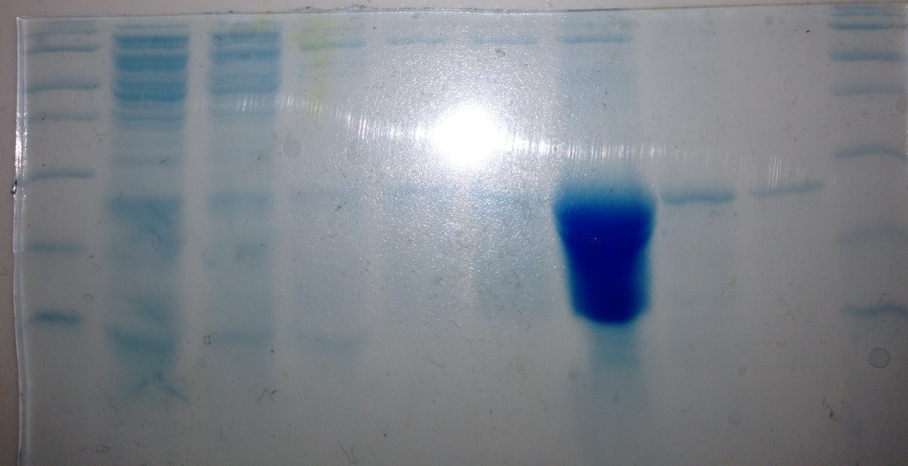
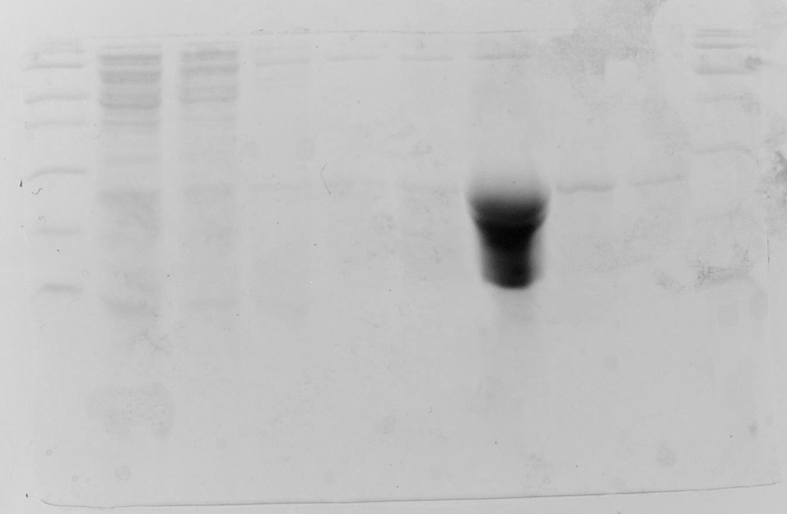

September 24th, 2012
====================

Gel Analysis of Fractions
^^^^^^^^^^^^^^^^^^^^^^^^^
Using a fresh solution of 15% Acrylamide SDS solution, a new gel was poured for
the analysis of the cobalt column fractions. The gel was polymerized with 50uL
each of 10% APS and TEMED. There were no problems with it today, however I
noted that the 3% stacking gel had not fully polymerized, I added APS and TEMED
to the remaining solution so that it could polymerize before disposal. 10uL
samples were taken from the column fractions and mixed with 10uL of 2X Loading
Buffer with DTT, then boiled for 4 minutes. After some cooling, the tubes were
spun briefly in a microfuge to bring condensate to the bottom. The gel was
loaded in the following sequence: L1, FT, W1, W2, W4, E1, E2, E3, E5, L2.
Pictures of the gel are shown below.

.. _9-24-12-expression:

Quantification of Expression
^^^^^^^^^^^^^^^^^^^^^^^^^^^^

Elution 2 was measured spectrographically to determine the quantity of purified
protein in its fraction, as it is greatly enriched in the product TLC.

After blanking the spectrophotometer at 280 nm on 950uL of elution buffer, 50uL
of E2 was added, mixed, and an absorbance reading was taken: **0.317 x 20 = 6.34**

:download:`ExPASy <TLC_ExPASy_Properties.txt>` predicts the extinction
coefficient :math:`\epsilon` to be 14,440 and gives the molar mass to be
19667. Calculations using the Beer-Lambert Law :math:`A=\epsilon \times l \times c`
show that the concentration of TLC is approximately **440uM** and given the
volume of 1mL, **8.663mg** of TLC was obtained in E2. This was derived from a
culture volume of 500mL. I would expect that a 1L culture volume could yield
enough protein for NMR studies.
